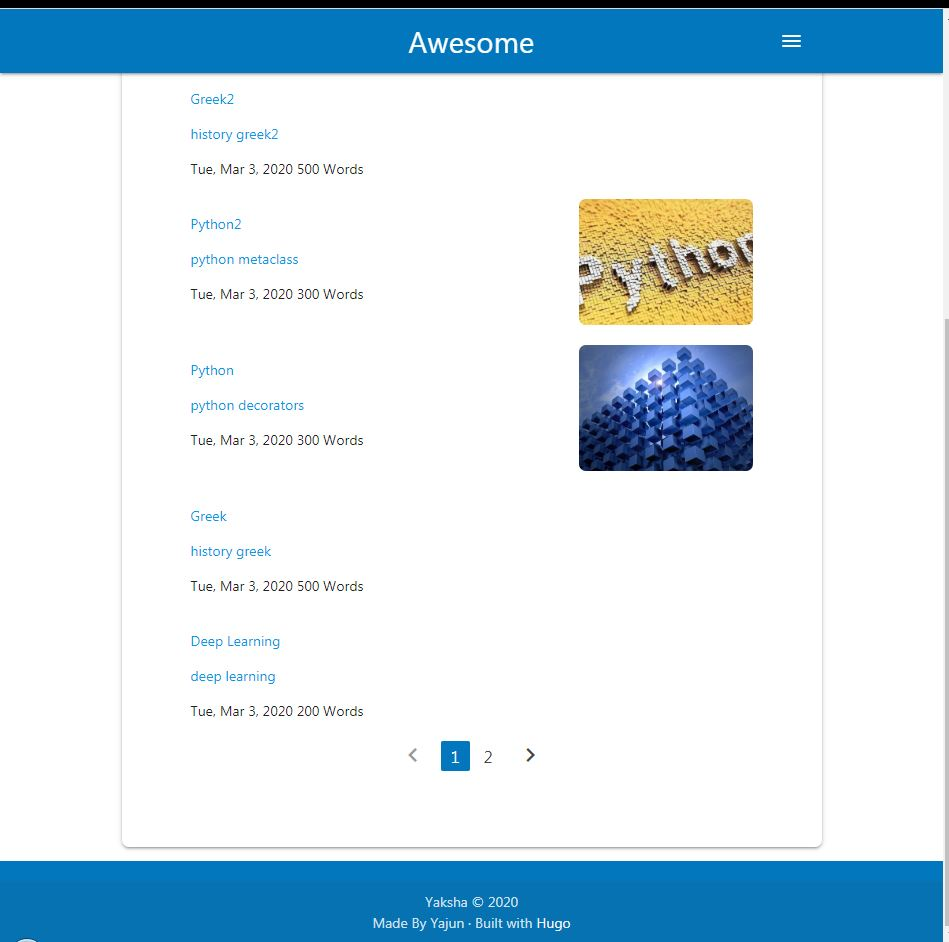
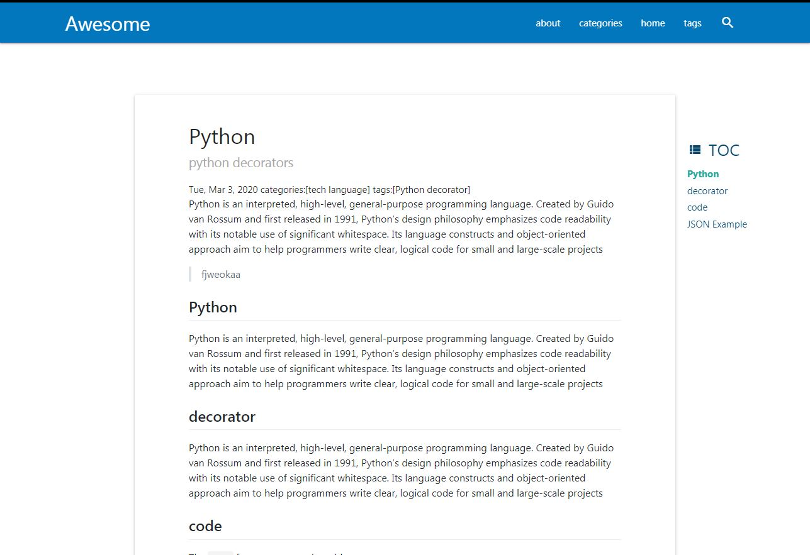

# Hugo-Theme

This Repository has two individual hugo theme. I am a new hand at front-end. To design and implement a custom hugo theme is still a hard task. I have to learn `html`, `css` and `javascript`. In addtion, `jquery`, `scss`, `dom`, `go/template` are still need to study. `Hugo` also consumes a lot of time. I choose `bootstrap4` and then modified.

I underestimate the  time-consuming of making a hugo-theme for a new hand.

I will finish this hugo theme when I  am free.

## 

## Whisper

### light mode

### dark mode

### Yaksha

