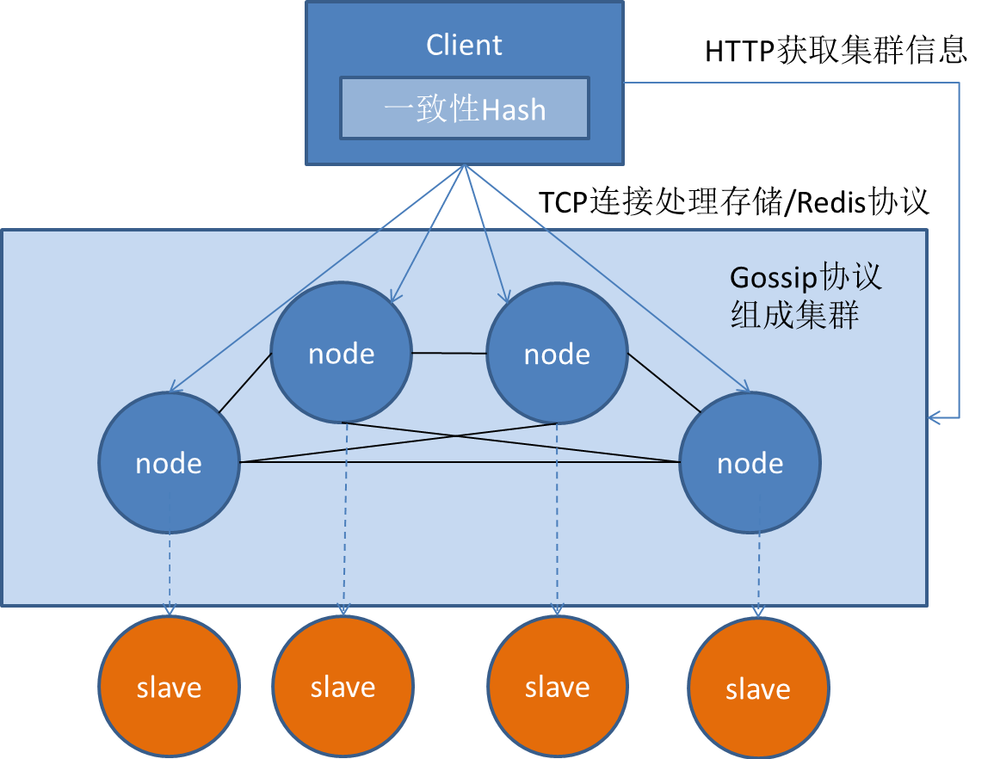

# PepperCache
Distributed k-v database/cache implemented by Golang. 
* Main Reference book: 《分布式缓存-原理、架构和Go语言实现》
* Main Reference repo: [alphali/godis](https://github.com/alphali/godis)

This is a **toy example**.

## scheme


## Usage

### 1. Compile
Run `sh make.sh` to compile. 

It will generate three bin-file:`server`,`client` and `benchmark`

### 2. Start Server
you can run `./bin/server --help` to get help info:
```bash
Usage of ./bin/server:
  -admin-port int
    	port (default 18088)
  -cluster string
    	cluster address
  -node string
    	node address (default "127.0.0.1")
  -port int
    	port (default 9004)
```
* Start first server. 
    ```bash
    # ./bin/server --node=0.0.0.1
    2019/12/25 11:40:53 Node is 0.0.0.1
    2019/12/25 11:40:53 Cluster is 0.0.0.1
    2019/12/25 11:40:53 Cache Server runs...
    2019/12/25 11:40:53 Cache Port: 9004
    2019/12/25 11:40:53 Cache PID: 3448
    ```
* Consult cluster info (only 1 server for now)
    ```bash
     # curl 0.0.0.1:18088/cluster
     ["0.0.0.1"]
    ```
* Start another server on another machine. `cluster` can be set as any IP_addr in cluster.
    ```bash
    # ./bin/server --node=0.0.0.2 --cluster=0.0.0.1
    2019/12/25 12:04:02 Node is 0.0.0.2
    2019/12/25 12:04:02 Cluster is 0.0.0.1
    2019/12/25 12:04:02 Cache Server runs...
    2019/12/25 12:04:02 Cache Port: 9004
    2019/12/25 12:04:02 Cache PID: 7310
    ```
* Consult cluster info 
    ```bash
    # curl 0.0.0.1:18088/cluster
    ["0.0.0.1", "0.0.0.2"]
    ```
### 3. Start Client
run `./bin/client --help` for help info.
```bash
Usage of ./bin/client:
  -node string
    	node address (default "127.0.0.1")
  -port int
    	port (default 9004)
```
* Start Clinet with connection to `0.0.0.1`
    ```bash
    # ./bin/client --node=0.0.0.1
    Welcome pepperCache-client!
    pepper-cli> get a
    (error) redirect 0.0.0.2
    pepper-cli> get b
    nil
    pepper-cli> set b
    (error) ERR wrong number of arguments for 'set' command
    pepper-cli> set b 12
    OK
    pepper-cli> get b
    12
    pepper-cli> exit
    goodbye!
    ```
* According to consistency hash, key is treated by different machine.
    ```bash
    ./bin/client --node=0.0.0.2
    Welcome pepperCache-client!
    pepper-cli> get a
    nil
    pepper-cli> get b
    (error) redirect 0.0.0.1
    pepper-cli> set a aaa
    OK
    pepper-cli> get a
    aaa
    pepper-cli> exit
    goodbye!
    ```

### 4. Support Aof Pesistence
Kill server on `0.0.0.1` and restart, the data is still retained. 

### 5. Benchmark
Supply benchmark tool for redis and Pepper-Cache.